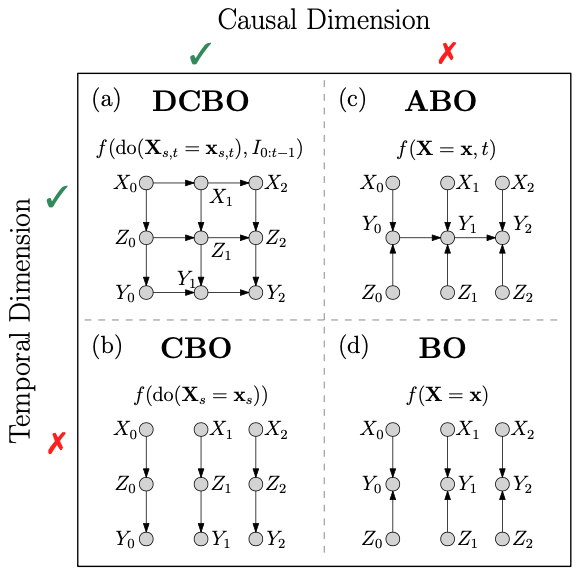

# Dynamic Causal Bayesian Optimization

This is a Python implementation of [Dynamic Causal Bayesian Optimization](https://nips.cc/) as presented at Neurips 2021.

## Abstract

This paper studies the problem of performing a sequence of optimal interventions in a causal dynamical system where both the target variable of interest and the inputs evolve over time. This problem arises in a variety of domains e.g. system biology and operational research. Dynamic Causal Bayesian Optimization (DCBO) brings together ideas from sequential decision making, causal inference and Gaussian process (GP) emulation. DCBO is useful in scenarios where all causal effects in a graph are changing over time. At every time step DCBO identifies a local optimal intervention by integrating both observational and past interventional data collected from the system. We give theoretical results detailing how one can transfer interventional information across time steps and define a dynamic causal GP model which can be used to quantify uncertainty and find optimal interventions in practice. We demonstrate how DCBO identifies optimal interventions faster than competing approaches in multiple settings and applications.


<p align="center" width="100%">
    
</p>

## Authors

[Virginia Aglietti](https://uk.linkedin.com/in/virginia-aglietti-a80321a4), [Neil Dhir](https://neildhir.github.io/), [Javier Gonzalez](https://javiergonzalezh.github.io/) and [Theodoros Damoulas](https://warwick.ac.uk/fac/sci/statistics/staff/academic-research/damoulas/)

## TODO

- Write tutorials

- Check license

- Parallelise sampling functions so that they are not sequential, that is far too slow

- Implement KDE for proper handling of exogeneous noise variables, as done in CEO

- Consider start using Julia/Fortran for heavy matrix operations e.g. for acquisition function evaluation

- For all classes, write optimal parameters with **kwargs instead, it is currently far too messy

## Installation

conda or pip

### Requirements

- python
- numpy
- scipy
- networkx

## Demo and tutorials

```
    Optimisation options:

    1) DCBO         : (causal_prior == True, dynamic == True)
    2) Dynamic BO   : (causal_prior == False, dynamic == True)
    3) CBO          : (causal_prior == True, dynamic == False)
    4) BO           : (causal_prior == False, dynamic == False)
```

- [stat_scm.ipynb](notebooks/stat_scm.ipynb) walks through the basic steps required to run all methods (BO, ABO, CBO and DCBO) on the example SCM shown in figure 1 of the paper.
- [nonstat_scm.ipynb](notebooks/stat_scm.ipynb) demonstrates how to run the methods on the SCM with the DAG shown in figure 3(c) of the paper, but over multiple recplicates, to allow for confidence bounds over the results.

## Citation

Please cite the NeurIPS paper if you use DCBO in your work:

```[bibtex]
@inproceedings{DCBO,
 author = {Aglietti, Virginia and Dhir, Neil and Gonz\'{a}lez, Javier and Damoulas, Theodoros},
 booktitle = {Advances in Neural Information Processing Systems},
 title = {Dynamic Causal Bayesian Optimization},
 volume = {35},
 year = {2021}
}
```

## License

This program is free software; you can redistribute it and/or modify it under the terms of the GNU General Public License as published by the Free Software Foundation; either version 3 of the License, or (at your option) any later version.

This program is distributed in the hope that it will be useful, but WITHOUT ANY WARRANTY; without even the implied warranty of MERCHANTABILITY or FITNESS FOR A PARTICULAR PURPOSE. See the GNU General Public License for more details.

You should have received a copy of the GNU General Public License along with this program. If not, see <http://www.gnu.org/licenses/>.
